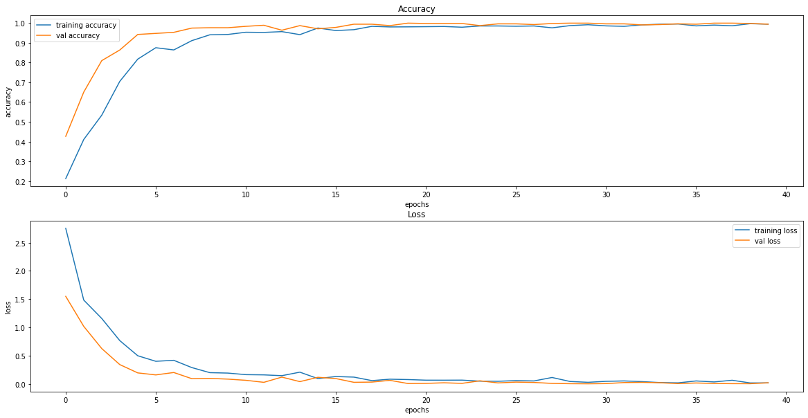

<div style="position: absolute; top: 0; right: 0;">
    <a href="ertugrulbusiness@gmail.com"></a>
    <a href="https://tr.linkedin.com/in/ertu%C4%9Fruldemir?original_referer=https%3A%2F%2Fwww.google.com%2F"></a>
    <a href="https://github.com/ertugruldmr"></a>
    <a href="https://www.kaggle.com/erturuldemir"></a>
    <a href="https://huggingface.co/ErtugrulDemir"></a>
    <a href="https://stackoverflow.com/users/21569249/ertu%c4%9frul-demir?tab=profile"></a>
    <a href="https://medium.com/@ertugrulbusiness"></a>
    <a href="https://www.youtube.com/channel/UCB0_UTu-zbIsoRBHgpsrlsA"></a>
</div>

# Speech Emotion Recognition
 
## __Table Of Content__
- (A) [__Brief__](#brief)
  - [__Project__](#project)
  - [__Data__](#data)
  - [__Demo__](#demo) -> [Live Demo](https://ertugruldemir-speechemotionrecognition.hf.space)
  - [__Study__](#problemgoal-and-solving-approach) -> [Colab](https://colab.research.google.com/drive/1G7X3b2rQwzrZE5KKNCkouvE6HDhY7DrN)
  - [__Results__](#results)
- (B) [__Detailed__](#Details)
  - [__Abstract__](#abstract)
  - [__Explanation of the study__](#explanation-of-the-study)
    - [__(A) Dependencies__](#a-dependencies)
    - [__(B) Dataset__](#b-dataset)
    - [__(C) Modelling__](#c-modelling)
    - [__(D) Deployment as web demo app__](#g-deployment-as-web-demo-app)
  - [__Licance__](#license)
  - [__Connection Links__](#connection-links)

## __Brief__ 

### __Project__ 
- This is a __Multi Variable Classification__ project on audio data  with  custom __deep learning model__. The project uses the  [__Toronto emotional speech set__](https://www.kaggle.com/datasets/ejlok1/toronto-emotional-speech-set-tess) to __classify__ the audio file into corresponding class.
- The __goal__ is build a deep learning model that accurately __classify__ the audio file into corresponding class. There are 7 classes.
- The performance of the model is evaluated using several __metrics__ loss.

#### __Overview__
- This project involves building a deep learning model to classify the audio files into one of the corresponding 7 classes. In the dataset, There are a set of 200 target words were spoken in the carrier phrase "Say the word _' by two actresses (aged 26 and 64 years) and recordings were made of the set portraying each of seven emotions (anger, disgust, fear, happiness, pleasant surprise, sadness, and neutral). There are 2800 data points (audio files) in total.  The models selected according to model tuning results, the progress optimized respectively the previous tune results. The project uses Python and several popular libraries such as Pandas, NumPy, tensorflow.

#### __Demo__

<div align="left">
  <table>
    <tr>
    <td>
        <a target="_blank" href="https://ertugruldemir-speechemotionrecognition.hf.space" height="30">[Demo app] HF Space</a>
      </td>
      <td>
        <a target="_blank" href="https://colab.research.google.com/drive/1LhOesbHWPF5WfaoegvgLNqu7SXS2v1HW">[Demo app] Run in Colab</a>
      </td>
      <td>
        <a target="_blank" href="https://github.com/ertugruldmr/SpeechEmotionRecognition/blob/main/study.ipynb">[Traning pipeline] source on GitHub</a>
      </td>
    <td>
        <a target="_blank" href="https://colab.research.google.com/drive/1G7X3b2rQwzrZE5KKNCkouvE6HDhY7DrN">[Traning pipeline] Run in Colab</a>
      </td>
    </tr>
  </table>
</div>


- Description
    -  __classify audio data__ into one of the corresponding 7 class.
    - __Usage__: 
      - upload or select an audio data then clikc the submit button for classification
- Embedded [Demo](https://ertugruldemir-speechemotionrecognition.hf.space) window from HuggingFace Space
    

<iframe
	src="https://ertugruldemir-speechemotionrecognition.hf.space"
	frameborder="0"
	width="850"
	height="450"
></iframe>

#### __Data__
- The  [__Toronto emotional speech set__](https://www.kaggle.com/datasets/ejlok1/toronto-emotional-speech-set-tess) from kaggle dataset api.
- There are a set of 200 target words were spoken in the carrier phrase "Say the word _' by two actresses (aged 26 and 64 years) 
- recordings were made of the set portraying each of seven emotions (anger, disgust, fear, happiness, pleasant surprise, sadness, and neutral). 
- There are 2800 data points (audio files) in total.
  - Example data
      <div style="display:flex; justify-content: center; align-items:center;">
        
        
      </div>
  - Target Distirbutions
      <div style="display:flex; justify-content: center; align-items:center;">
        
      </div>
#### Problem, Goal and Solving approach
- TThis is a __Multi Variable Recognition__ problem  that uses the  [__Toronto emotional speech set__](https://www.kaggle.com/datasets/ejlok1/toronto-emotional-speech-set-tess)   to __classify the audio data__ into one of the 7 class.
- The __goal__ is build a deep learning  model that accurately __recognize the audio data__ into one of the 7 class.
- __Solving approach__ is that using the supervised deep learning models. Basic Custom 1d convolution Classifier model is used for audio data classification.

#### Study
The project aimed classifying the audio data into one of the 7 classes using deep learning model architecture. The study includes following chapters.
- __(A) Dependencies__: Installations and imports of the libraries.
- __(B) Dataset__: Downloading and loading the dataset. Preparing the dataset from official website. Configurating the dataset performance and related pre-processes. 
- __(C) Preprocessing__: loading the data convenient form, analyzing the data, exploring the data, implementing feature extraction as mean of mfcc methodconfigurating the dataset object, batching, performance setting, visualizating, Implementing the audio data related processes.
- __(D) Modelling__:
  - Model Architecture
    - Custom Custom 1d convolution Classifier model used to classify audio data into one of the 7 classes.
  - Training
    - Callbakcs and trainin params are setted. some of the callbacks are EarlyStopping, ModelCheckpoint, Tensorboard etc....  
    - training history
        <div style="display:flex; justify-content: center; align-items:center;">
          
        </div>
  - Saving the model
    - Saved the model as tensorflow saved model format.
- __(E) Deployment as web demo app__: Creating Gradio Web app to Demostrate the project.Then Serving the demo via huggingface as live.

#### results
- The final model is __Custom 1d Convolutional  Classifier Model__   because of the results and less complexity.
  -  Custom 1d Convolutional  Classifier Model
        <table><tr><th>Model Results </th><th></th></tr><tr><td>
  |   | loss  | val_loss  | accuracy  |  val_accuracy  |
  |---|-------|-------|-------|-------|
  |   |  0.0189 |0.0212| 0.9933 | 0.9929 |
    </td></tr></table>

## Details

### Abstract
- [__Toronto emotional speech set__](https://www.kaggle.com/datasets/ejlok1/toronto-emotional-speech-set-tess)  is used to classify audio data into one of the 7 classes. There are a set of 200 target words were spoken in the carrier phrase "Say the word _' by two actresses (aged 26 and 64 years). recordings were made of the set portraying each of seven emotions (anger, disgust, fear, happiness, pleasant surprise, sadness, and neutral). There are 2800 data points (audio files) in total. The goal is build a deep learning model that accurately recognize audio data one of the 7 classes using through custom 1d Convolutional  Classifier Model classifer as deep learning algorithms via related training approachs such as  pretrained state of art models.The study includes creating the environment, getting the data, preprocessing the data, exploring the data, mormalizing the audio data, reforming the data to convenient notation, feature extraction as mfcc, configurating the dataset object, batching, performance setting, visualizating, modelling the data, saving the results, deployment as demo app. Training phase of the models implemented through tensorflow callbacks. After the custom model traininigs, transfer learning and fine tuning approaches are implemented. Selected the basic and more succesful when comparet between other models, final model is custom 1d convolutional  classifier model. __Custom 1D Convolutional Classifier Model__ model  has __0.0189__ loss, __0.0212__ validation loss, __0.9933__ accuracy, __0.9929__ validation accuracy  other metrics are also found the results section. Created a demo at the demo app section and served on huggingface space.  

### File Structures

- File Structure Tree
```bash
├── demo_app
│   ├── app.py
│   ├── examples
│   ├── requirements.txt
│   ├── sound_emotion_rec_model
├── docs
│   └── images
├── env
│   └── env_installation.md
├── LICENSE
├── readme.md
├── requirements.txt
└── study.ipynb
```
- Description of the files
  - demo_app/
    - Includes the demo web app files, it has the all the requirements in the folder so it can serve on anywhere.
  - demo_app/sound_emotion_rec_model:
    - Custom 1d convolutional  classifier model for classifying the audio data into one of the 10 classes.
  - demo_app/examples
    - It includes test case files. 
  - docs/
    - Includes the documents about results and presentations
  - env/
    - It includes the training environmet related files. these are required when you run the study.ipynb file.
  - LICENSE.txt
    - It is the pure apache 2.0 licence. It isn't edited.
  - readme.md
    - It includes all the explanations about the project
  - study.ipynb
    - It is all the studies about solving the problem which reason of the dataset existance. 
  - requirements.txt
    - It includes the library dependencies of the study.   

### Explanation of the Study
#### __(A) Dependencies__:
  - There is a third-part installation as kaggle dataset api the other requirements will be alread installed while creating the environment. Just follow the code order to satisfy requirements. You can create an environment via env/requirements.txt. Create a virtual environment then use hte following code. It is enough to satisfy the requirements for runing the study.ipynb which training pipeline.
  - Dataset can download from kaggle dataset.
#### __(B) Dataset__: 
  - Downloading the [__Toronto emotional speech set__](https://www.kaggle.com/datasets/ejlok1/toronto-emotional-speech-set-tess) via kaggle dataset api. 
  - There are a set of 200 target words were spoken in the carrier phrase "Say the word _' by two actresses (aged 26 and 64 years) 
  - recordings were made of the set portraying each of seven emotions (anger, disgust, fear, happiness, pleasant surprise, sadness, and neutral). 
  - There are 2800 data points (audio files) in total.
  - Example data
      <div style="display:flex; justify-content: center; align-items:center;">
        
        
      </div>
      <div style="display:flex; justify-content: center; align-items:center;">
        
        
      </div>
  - Target Distirbutions
      <div style="display:flex; justify-content: center; align-items:center;">
        
      </div>

#### __(C) Modelling__: 
  - The processes are below:
    - Model Architecture
      - Custom 1d Convolutional  Classifier Model used to classify audio data into one of the 7 classes.
      - Architecture
        <div style="display:flex; justify-content: center; align-items:center;">
          
        </div>
      - Training
        - Callbakcs and trainin params are setted. some of the callbacks are EarlyStopping, ModelCheckpoint, Tensorboard etc....  
        - training history
          <div style="display:flex; justify-content: center; align-items:center;">
            
          </div>
    - Saving the model
      - Saved the model as tensorflow saved model format.
  - __(E) Deployment as web demo app__: Creating Gradio Web app to Demostrate the project.Then Serving the demo via huggingface as live.

  #### results
- The final model is __Custom 1d Convolutional  Classifier Model__   because of the results and less complexity.
  -  Custom 1d Convolutional  Classifier Model
        <table><tr><th>Model Results </th><th></th></tr><tr><td>
  |   | loss  | val_loss  | accuracy  |  val_accuracy  |
  |---|-------|-------|-------|-------|
  |   |  0.0189 |0.0212| 0.9933 | 0.9929 |
    </td></tr></table>

#### __(D) Deployment as web demo app__: 
  - Creating Gradio Web app to Demostrate the project.Then Serving the demo via huggingface as live.
  - Desciption
    - Project goal is recogniting the audio data into one of the 7 classes.
    - Usage: upload or select audio data then use the button to recognize.
  - Demo
    - The demo app in the demo_app folder as an individual project. All the requirements and dependencies are in there. You can run it anywhere if you install the requirements.txt.
    - You can find the live demo as huggingface space in this [demo link](https://ertugruldemir-speechemotionrecognition.hf.space) as full web page or you can also us the [embedded demo widget](#demo)  in this document.  
    
## License
- This project is licensed under the Apache 2.0 License. See the [LICENSE](LICENSE) file for details.

<h1 style="text-align: center;">Connection Links</h1>

<div style="text-align: center;">
    <a href="ertugrulbusiness@gmail.com"></a>
    <a href="https://tr.linkedin.com/in/ertu%C4%9Fruldemir?original_referer=https%3A%2F%2Fwww.google.com%2F"></a>
    <a href="https://github.com/ertugruldmr"></a>
    <a href="https://www.kaggle.com/erturuldemir"></a>
    <a href="https://huggingface.co/ErtugrulDemir"></a>
    <a href="https://stackoverflow.com/users/21569249/ertu%c4%9frul-demir?tab=profile"></a>
    <a href="https://www.hackerrank.com/ertugrulbusiness"></a>
    <a href="https://app.patika.dev/ertugruldmr"></a>
    <a href="https://medium.com/@ertugrulbusiness"></a>
    <a href="https://www.youtube.com/channel/UCB0_UTu-zbIsoRBHgpsrlsA"></a>
</div>

